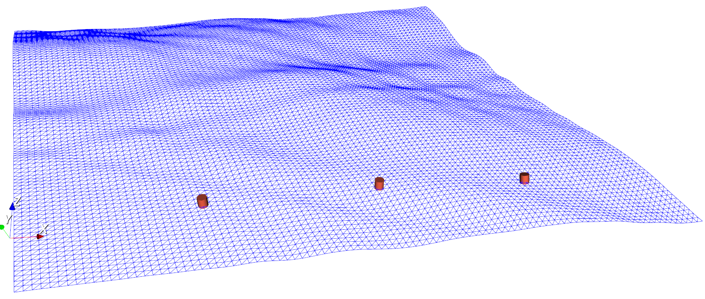

# ASVLite

## Introduction
ASVLite is a simulator that provides high fidelity and computationally efficient model of ocean waves and dynamics of marine surface vehicles in waves. The simulator is ideal for applications requiring high run-time performance, such as with simulation of a swarm of autonomous marine vehicles, or in developing optimal vehicle control strategies using reinforcement learning techniques. ASVLite also has a low computational overhead making it ideal for onboard simulation for applications such as online learning for adaptation to changes in the environment. 

If you are using this simulator for your research, then please cite: [ASVLite: a high-performance simulator for autonomous surface vehicles](https://arxiv.org/abs/2003.04599).

The image below show visualisation of the ocean surface and three ASVs simulated by ASVLite.



## Build instruction
``` 
git clone --recurse-submodules https://github.com/resilient-swarms/asv-swarm.git
cd asv-swarm
mkdir build
cd build
cmake -DCMAKE_BUILD_TYPE=Release ..
make 
```

## Running the simulator
The simulator requires the following values as command-line arguments:
1. input file, 
2. output file,
3. significant wave height of the sea state to simulate, 
4. predominant wave direction of the wave,
5. random seed number.

Example for simulating vehicle dynamics in a sea with a significant wave height of 1.2 m, wave heading of 20<sup>o</sup>North and with a random number seed of 3:
```
asv_simulator input_file out_file 1.2 20.0 3
```

The `input_file` uses `toml` syntax and should provide the inputs required for the simulation. Given below is an example of an input file. 
```
# Physical specification of the vehicle. 

[[asv]]
id = "asv0"
L_wl = 0.3 # m
B_wl = 0.3 # m
D = 0.3  # m
T = 0.1 # m
displacement = 0.007 # m3
max_speed = 2.0 # m/s
cog = [0.15, 0.0, -0.2] # [x(m), y(m), z(m)]
radius_of_gyration = [0.08, 0.08, 0.106] # [r_roll(m), r_pitch(m), r_yaw(m)]
thrusters = [[0.065, -0.085, -0.0485], 
			 [0.235, -0.085, -0.0485], 
			 [0.235, 0.085, -0.0485], 
			 [0.065, 0.085, -0.0485]] # [[x(m), y(m), z(m)]]
asv_position = [5.0, 0.0] # [X(m), Y(m)]
asv_attitude = [0.0, 0.0, 0.0] #[heel(deg), trim(deg), heading(deg)]
waypoints = [[5.0, 20.0]] # [[X(m), Y(m)]]

# For simulating multiple vehicle, define multiple tables of [[asv]]
# A second ASV
[[asv]]
id = "asv1"
L_wl = 0.3 # m
B_wl = 0.3 # m
D = 0.3  # m
T = 0.1 # m
displacement = 0.007 # m3
max_speed = 2.0 # m/s
cog = [0.15, 0.0, -0.2] # [x(m), y(m), z(m)]
radius_of_gyration = [0.08, 0.08, 0.106] # [r_roll(m), r_pitch(m), r_yaw(m)]
thrusters = [[0.065, -0.085, -0.0485], 
			 [0.235, -0.085, -0.0485], 
			 [0.235, 0.085, -0.0485], 
			 [0.065, 0.085, -0.0485]] # [[x(m), y(m), z(m)]]
asv_position = [10.0, 0.0] # [X(m), Y(m)]
asv_attitude = [0.0, 0.0, 0.0] #[heel(deg), trim(deg), heading(deg)]
waypoints = [[10.0, 20.0]] # [[X(m), Y(m)]]

# A third ASV
[[asv]]
id = "asv2"
L_wl = 0.3 # m
B_wl = 0.3 # m
D = 0.3  # m
T = 0.1 # m
displacement = 0.007 # m3
max_speed = 2.0 # m/s
cog = [0.15, 0.0, -0.2] # [x(m), y(m), z(m)]
radius_of_gyration = [0.08, 0.08, 0.106] # [r_roll(m), r_pitch(m), r_yaw(m)]
thrusters = [[0.065, -0.085, -0.0485], 
			 [0.235, -0.085, -0.0485], 
			 [0.235, 0.085, -0.0485], 
			 [0.065, 0.085, -0.0485]] # [[x(m), y(m), z(m)]]
asv_position = [15.0, 0.0] # [X(m), Y(m)]
asv_attitude = [0.0, 0.0, 0.0] #[heel(deg), trim(deg), heading(deg)]
waypoints = [[15.0, 20.0]] # [[X(m), Y(m)]]

[clock]
time_step_size = 40 # milli-sec

[visualisation]
sea_surface_edge_length = 20.0 #m
count_mesh_cells_along_edge = 20 # Number of mesh cells along one edge of the sea surface. A larger number means a finer sea surface mesh.
```

## Using ASVLite as a software library. 

For details of the programming interface provided by ASVLite,
refer to the Doxygen generated documentation `doc/html/index.html`.
