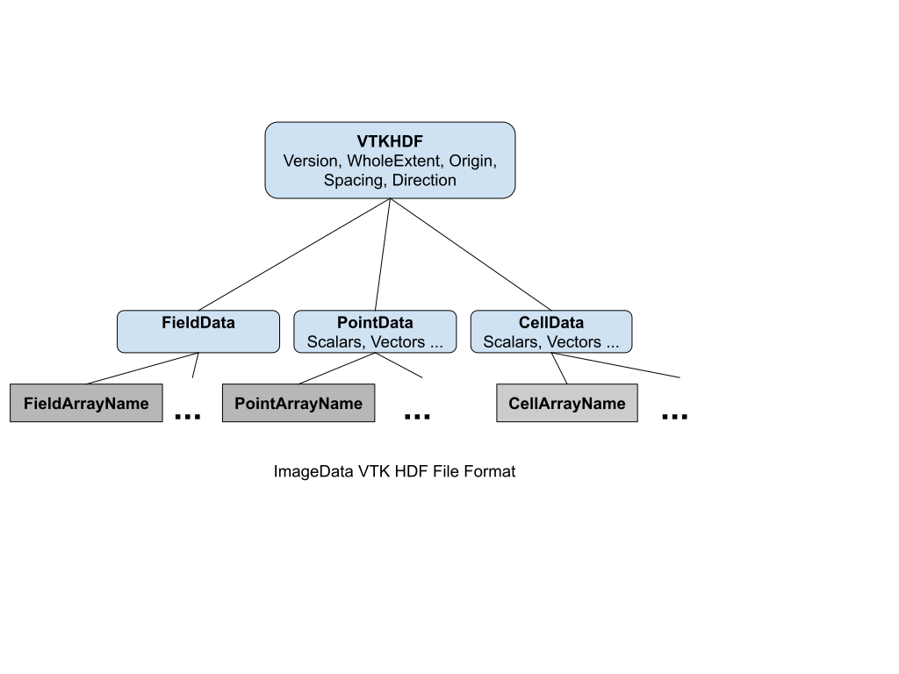
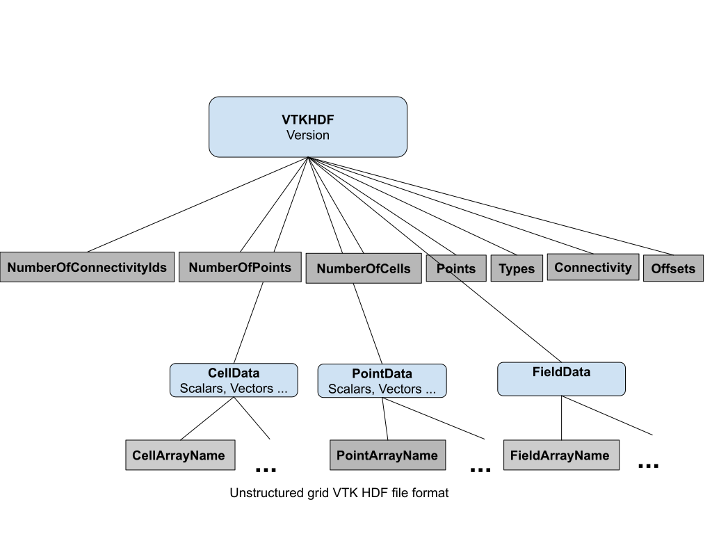

# VTK HDF File Format {#VTKHDFFileFormat}

VTK 10.0 introduces the VTK HDF format for VTK datasets. The goal of
this work is to provide simulations with a way to save data in HDF
that could be easily loaded in VTK without the need for external data
description (such as XDMF). We use the same extension for serial and
parallel formats and for all types of datasets. We use HDF standard
file extensions such as hdf, hdf5, h5 or he5.

In the following diagrams showing the HDF file structure for VTK
datasets, the rounded blue rectangles are HDF groups and the gray
rectangles are HDF datasets. Each rectangle shows the name of the
group or dataset in bold font and the attributes underneath with
regular font.

VTK HDF files start with a group called `VTKHDF` with one attribute:
`Version`, an array of two integers. Additional attributes can follow
depending on the dataset type stored in the file.

The data type for each HDF dataset is part of the dataset and it is
determined at write time. The reader matches the type of the dataset
with a `H5T_NATIVE_` type and creates the VTK array of that
type. Consequently, the type at writing might be different than the
type at reading even on the same machine because for instance `long`
can be the same type as `long long` or `int` can be the same as `long`
on certain platforms. Also, `vtkIdType` is read as the C++ type it
represents (`long` or `long long`). Endianness conversions are done
automatically.

## Image data

An ImageData (regular grid) is not split into partitions for parallel
processing. We rely on the writer to chunk the data to optimize
reading for a certain number of MPI ranks. Attribute data is stored in
a PointData or CellData array using hyper slabs. `WholeExtent`,
`Origin`, `Spacing` and `Direction` attributes have the same meaning
as the coresponding attributes for `vtkImageData`. `Scalars`,
`Vectors`, ... string atributes for the `PointData` and `CellData`
groups specify the active attributes in the dataset.



## Unstructured grid
The unstructured grid is split into partitions, with a partition for
each MPI node. This is reflected in the HDF5 file structure. Each HDF
dataset is obtained by concatenating the data for each partition. The
offset O(i) where we store the data for partition i is computed using:

O(i) = S(0) + ... + S(i-1), i > 1 with O(0) = 0.

where S(i) is the size of partition i.

An unstructured grid file has a HDF5 structure shown in the next
picture. We describe the split into partitions using HDF5 datasets
`NumberOfConnectivityIds`, `NumberOfPoints` and `NumberOfCells`. Let n
be the number of partitions which usually correspond to the number of
the MPI ranks. `NumberOfConnectivityIds` has size n where
NumberOfConnectivityIds[i] represents the size of the `Connectivity`
array for partition i. `NumberOfPoints` and `NumberOfCells` are arrays
of size n, where NumberOfPoints[i] and NumberOfCells[i] are the number
of points and number of cells for partition i. The `Points` array
contains the points of the VTK dataset. `Offsets` is an array of size
∑ S(i), where S(i) is the size of partition i, indicating the index in
the `Connectivity` array where each cell's points start.
`Connectivity` stores the lists of point ids for each cell, and
`Types` contain the cell information stored as described in
`vtkCellArray` documentation. Data for each partition is appended in a
HDF dataset for `Points`, `Connectivity`, `Offsets`, `Types`,
`PointData` and `CellData`. We can compute the size of partition i
using the following formulas:

|   | Size of partition i |
|:--|:--|
| Points  | NumberOfPoints[i] * 3 * sizeof(Points[0][0])  |
| Connectivity  | NumberOfConnectivityIds[i] * sizeof(Connectivity[0]) |
| Offsets  | (NumberOfCells[i] + 1) * sizeof(Offsets[0]) |
| Types  | NumberOfCells[i] * sizeof(Types[i]) |
| PointData  | NumberOfPoints[i] * sizeof(point_array_k[0]) |
| CellData | NumberOfCells[i] * sizeof(cell_array_k[0]) |



To read the data for its rank a node reads the information about all
partitions, compute the correct offset and then read data from that
offset.

## Limitations

This specification and the reader available in VTK currently only
supports ImageData and UnstructuredGrid. Other dataset types may be
added later dependeing on interest and funding.

## Examples

We present two examples of VTK HDF files, shown using h5dump -A one
image file and one unstructured grid. These files can be examined in
the VTK source code, by building VTK and enabling testing
(`VTK_BUILD_TESTING`).  The two files are in the build directory
ExternalData at `Testing/Data/mandelbrot-vti.hdf` for the ImageData
and at `Testing/Data/can-pvtu.hdf` for the partitioned UnstructuredGrid.

### ImageData

The image data file is a wavelet source produced in ParaView. Note
that we don't partition image data, so the same format is used for
serial and parallel processing.

```
HDF5 "./ExternalData/Testing/Data/mandelbrot-vti.hdf" {
GROUP "/" {
   GROUP "VTKHDF" {
      ATTRIBUTE "Direction" {
         DATATYPE  H5T_IEEE_F64LE
         DATASPACE  SIMPLE { ( 9 ) / ( 9 ) }
         DATA {
         (0): 1, 0, 0, 0, 1, 0, 0, 0, 1
         }
      }
      ATTRIBUTE "Origin" {
         DATATYPE  H5T_IEEE_F64LE
         DATASPACE  SIMPLE { ( 3 ) / ( 3 ) }
         DATA {
         (0): -1.75, -1.25, 0
         }
      }
      ATTRIBUTE "Spacing" {
         DATATYPE  H5T_IEEE_F64LE
         DATASPACE  SIMPLE { ( 3 ) / ( 3 ) }
         DATA {
         (0): 0.131579, 0.125, 0.0952381
         }
      }
      ATTRIBUTE "Version" {
         DATATYPE  H5T_STD_I64LE
         DATASPACE  SIMPLE { ( 2 ) / ( 2 ) }
         DATA {
         (0): 1, 0
         }
      }
      ATTRIBUTE "WholeExtent" {
         DATATYPE  H5T_STD_I64LE
         DATASPACE  SIMPLE { ( 6 ) / ( 6 ) }
         DATA {
         (0): 0, 19, 0, 20, 0, 21
         }
      }
      GROUP "PointData" {
         ATTRIBUTE "Scalars" {
            DATATYPE  H5T_STRING {
               STRSIZE 18;
               STRPAD H5T_STR_NULLPAD;
               CSET H5T_CSET_ASCII;
               CTYPE H5T_C_S1;
            }
            DATASPACE  SCALAR
            DATA {
            (0): "IterationsGradient"
            }
         }
         DATASET "Iterations" {
            DATATYPE  H5T_IEEE_F32LE
            DATASPACE  SIMPLE { ( 22, 21, 20 ) / ( 22, 21, 20 ) }
         }
         DATASET "IterationsGradient" {
            DATATYPE  H5T_IEEE_F64LE
            DATASPACE  SIMPLE { ( 22, 21, 20, 3 ) / ( 22, 21, 20, 3 ) }
         }
         DATASET "Iterations_double" {
            DATATYPE  H5T_IEEE_F64LE
            DATASPACE  SIMPLE { ( 22, 21, 20 ) / ( 22, 21, 20 ) }
         }
         DATASET "point_index_llong" {
            DATATYPE  H5T_STD_I64LE
            DATASPACE  SIMPLE { ( 22, 21, 20 ) / ( 22, 21, 20 ) }
         }
         DATASET "xextent_int" {
            DATATYPE  H5T_STD_I32LE
            DATASPACE  SIMPLE { ( 22, 21, 20 ) / ( 22, 21, 20 ) }
         }
         DATASET "xextent_long" {
            DATATYPE  H5T_STD_I64LE
            DATASPACE  SIMPLE { ( 22, 21, 20 ) / ( 22, 21, 20 ) }
         }
         DATASET "xextent_uint" {
            DATATYPE  H5T_STD_U32LE
            DATASPACE  SIMPLE { ( 22, 21, 20 ) / ( 22, 21, 20 ) }
         }
         DATASET "xextent_ulong" {
            DATATYPE  H5T_STD_U64LE
            DATASPACE  SIMPLE { ( 22, 21, 20 ) / ( 22, 21, 20 ) }
         }
      }
   }
}
}
```

### UnstructuredGrid

The unstructured grid is the can example (only the can, not the brick) from ParaView, partitioned in three:

```
HDF5 "./ExternalData/Testing/Data/can-pvtu.hdf" {
GROUP "/" {
   GROUP "VTKHDF" {
      ATTRIBUTE "Version" {
         DATATYPE  H5T_STD_I64LE
         DATASPACE  SIMPLE { ( 2 ) / ( 2 ) }
         DATA {
         (0): 1, 0
         }
      }
      GROUP "CellData" {
         DATASET "EQPS" {
            DATATYPE  H5T_IEEE_F64LE
            DATASPACE  SIMPLE { ( 5480 ) / ( H5S_UNLIMITED ) }
         }
         DATASET "vtkGhostType" {
            DATATYPE  H5T_STD_U8LE
            DATASPACE  SIMPLE { ( 5480 ) / ( H5S_UNLIMITED ) }
         }
         DATASET "vtkOriginalCellIds" {
            DATATYPE  H5T_STD_I64LE
            DATASPACE  SIMPLE { ( 5480 ) / ( H5S_UNLIMITED ) }
         }
      }
      DATASET "Connectivity" {
         DATATYPE  H5T_STD_I64LE
         DATASPACE  SIMPLE { ( 43840 ) / ( H5S_UNLIMITED ) }
      }
      GROUP "FieldData" {
         DATASET "ElementBlockIds" {
            DATATYPE  H5T_STD_I32LE
            DATASPACE  SIMPLE { ( 1 ) / ( 1 ) }
         }
         DATASET "Info_Records" {
            DATATYPE  H5T_STD_I8LE
            DATASPACE  SIMPLE { ( 4, 81 ) / ( 4, 81 ) }
         }
         DATASET "KE" {
            DATATYPE  H5T_IEEE_F64LE
            DATASPACE  SIMPLE { ( 44 ) / ( 44 ) }
         }
         DATASET "NSTEPS" {
            DATATYPE  H5T_IEEE_F64LE
            DATASPACE  SIMPLE { ( 44 ) / ( 44 ) }
         }
         DATASET "QA_Records" {
            DATATYPE  H5T_STD_I8LE
            DATASPACE  SIMPLE { ( 24, 33 ) / ( 24, 33 ) }
         }
         DATASET "TMSTEP" {
            DATATYPE  H5T_IEEE_F64LE
            DATASPACE  SIMPLE { ( 44 ) / ( 44 ) }
         }
         DATASET "TimeValue" {
            DATATYPE  H5T_IEEE_F64LE
            DATASPACE  SIMPLE { ( 1 ) / ( 1 ) }
         }
         DATASET "Title" {
            DATATYPE  H5T_STRING {
               STRSIZE H5T_VARIABLE;
               STRPAD H5T_STR_NULLTERM;
               CSET H5T_CSET_ASCII;
               CTYPE H5T_C_S1;
            }
            DATASPACE  SIMPLE { ( 1 ) / ( 1 ) }
         }
         DATASET "XMOM" {
            DATATYPE  H5T_IEEE_F64LE
            DATASPACE  SIMPLE { ( 44 ) / ( 44 ) }
         }
         DATASET "YMOM" {
            DATATYPE  H5T_IEEE_F64LE
            DATASPACE  SIMPLE { ( 44 ) / ( 44 ) }
         }
         DATASET "ZMOM" {
            DATATYPE  H5T_IEEE_F64LE
            DATASPACE  SIMPLE { ( 44 ) / ( 44 ) }
         }
      }
      DATASET "NumberOfCells" {
         DATATYPE  H5T_STD_I64LE
         DATASPACE  SIMPLE { ( 3 ) / ( 3 ) }
      }
      DATASET "NumberOfConnectivityIds" {
         DATATYPE  H5T_STD_I64LE
         DATASPACE  SIMPLE { ( 3 ) / ( 3 ) }
      }
      DATASET "NumberOfPoints" {
         DATATYPE  H5T_STD_I64LE
         DATASPACE  SIMPLE { ( 3 ) / ( 3 ) }
      }
      DATASET "Offsets" {
         DATATYPE  H5T_STD_I64LE
         DATASPACE  SIMPLE { ( 5483 ) / ( H5S_UNLIMITED ) }
      }
      GROUP "PointData" {
         DATASET "ACCL" {
            DATATYPE  H5T_IEEE_F64LE
            DATASPACE  SIMPLE { ( 8076, 3 ) / ( H5S_UNLIMITED, 3 ) }
         }
         DATASET "DISPL" {
            DATATYPE  H5T_IEEE_F64LE
            DATASPACE  SIMPLE { ( 8076, 3 ) / ( H5S_UNLIMITED, 3 ) }
         }
         DATASET "GlobalNodeId" {
            DATATYPE  H5T_STD_I64LE
            DATASPACE  SIMPLE { ( 8076 ) / ( H5S_UNLIMITED ) }
         }
         DATASET "PedigreeNodeId" {
            DATATYPE  H5T_STD_I64LE
            DATASPACE  SIMPLE { ( 8076 ) / ( H5S_UNLIMITED ) }
         }
         DATASET "VEL" {
            DATATYPE  H5T_IEEE_F64LE
            DATASPACE  SIMPLE { ( 8076, 3 ) / ( H5S_UNLIMITED, 3 ) }
         }
         DATASET "vtkGhostType" {
            DATATYPE  H5T_STD_U8LE
            DATASPACE  SIMPLE { ( 8076 ) / ( H5S_UNLIMITED ) }
         }
      }
      DATASET "Points" {
         DATATYPE  H5T_IEEE_F64LE
         DATASPACE  SIMPLE { ( 8076, 3 ) / ( H5S_UNLIMITED, 3 ) }
      }
      DATASET "Types" {
         DATATYPE  H5T_STD_U8LE
         DATASPACE  SIMPLE { ( 5480 ) / ( H5S_UNLIMITED ) }
      }
   }
}
}
```
